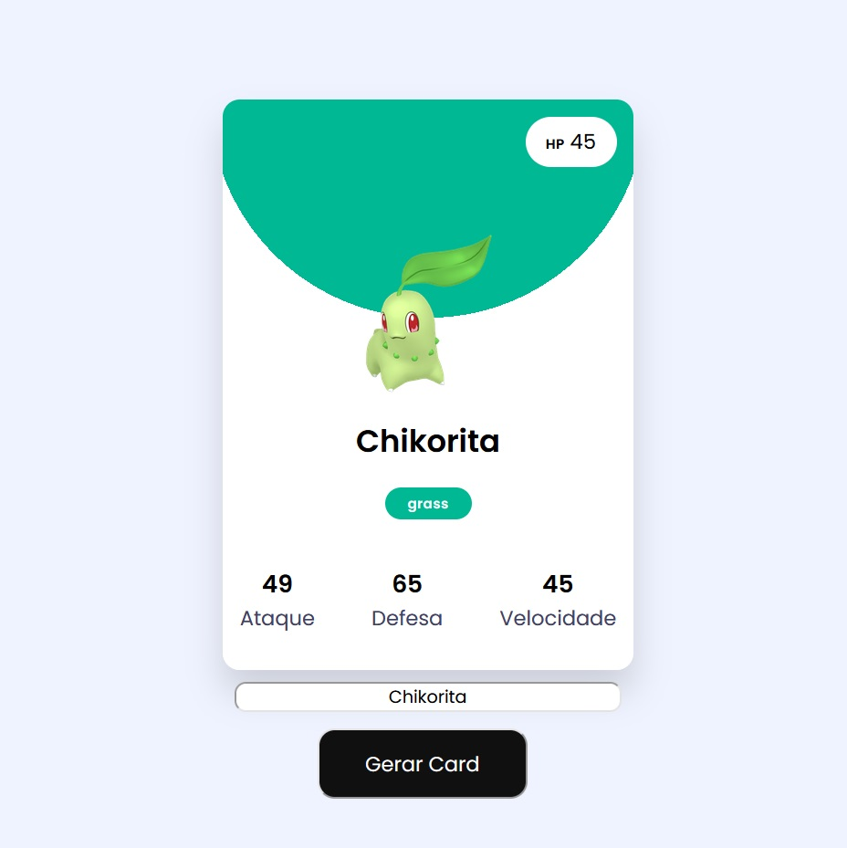

# Pokémon Card Generator 🎴

Um gerador de cards de Pokémon que exibe informações sobre cada Pokémon, incluindo suas estatísticas básicas, tipos e uma imagem. O projeto utiliza a PokéAPI para obter dados em tempo real.



## 📋 Índice

- [Funcionalidades](#funcionalidades)
- [Tecnologias Utilizadas](#tecnologias-utilizadas)
- [Como Usar](#como-usar)
- [Estrutura do Projeto](#estrutura-do-projeto)
- [API](#api)
- [Responsividade](#responsividade)
- [Personalização](#personalização)
- [Troubleshooting](#troubleshooting)

## ✨ Funcionalidades

- **Busca de Pokémon**: Por nome ou número da Pokédex
- **Exibição de Estatísticas**: HP, Ataque, Defesa e Velocidade
- **Tipos**: Exibição visual dos tipos do Pokémon com cores correspondentes
- **Design Responsivo**: Adaptável a diferentes tamanhos de tela
- **Animações**: Efeitos visuais suaves durante interações
- **Cores Dinâmicas**: Background do card muda de acordo com o tipo principal do Pokémon

## 🚀 Tecnologias Utilizadas

- HTML5
- CSS3
- JavaScript (ES6+)
- [PokéAPI](https://pokeapi.co/)

## 💻 Como Usar

1. Clone o repositório:
```bash
git clone https://github.com/RNTrybusy/pokemon-card-generator.git
```

2. Navegue até o diretório do projeto:
```bash
cd pokemon-card-generator
```

3. Abra o arquivo `index.html` em seu navegador ou use um servidor local.

4. Para buscar um Pokémon:
   - Digite o nome do Pokémon (em inglês) ou seu número na Pokédex
   - Clique no botão "Buscar" ou pressione Enter
   - O card será atualizado com as informações do Pokémon

## 📁 Estrutura do Projeto

```
pokemon-card-generator/
├── index.html
├── src/
│   ├── css/
│   |   ├── styles.css
│   |   ├── reset.css
│   |   └── responsive.css
|   ├── js/
│   |   └── script.js
|   └── images/
|       ├── pokeball_favicon.png
│       └── preview.jpeg
└── README.md
```

## 🔌 API

Este projeto utiliza a [PokéAPI](https://pokeapi.co/), uma API RESTful gratuita para dados de Pokémon.

### Endpoints Principais

- `https://pokeapi.co/api/v2/pokemon/{id ou nome}` - Retorna dados de um Pokémon específico

### Limites de Uso

- A API não requer autenticação
- Limite de 100 requisições por minuto por IP
- Não é necessário criar conta ou obter chave de API
- Dados disponíveis apenas em inglês

### Exemplo de Requisição

```javascript
fetch('https://pokeapi.co/api/v2/pokemon/pikachu')
    .then(response => response.json())
    .then(data => console.log(data));
```

### Dados Retornados

Os principais dados utilizados no projeto são:
- `name`: Nome do Pokémon
- `sprites`: URLs das imagens
- `stats`: Estatísticas base (HP, Ataque, etc.)
- `types`: Tipos do Pokémon

## 📱 Responsividade

O projeto é totalmente responsivo e se adapta aos seguintes breakpoints:

- Smartphones pequenos: até 380px
- Smartphones médios: 381px - 480px
- Tablets e smartphones grandes: 481px - 768px
- Tablets grandes e laptops: 769px - 1024px
- Desktop: 1025px ou mais

## 🎨 Personalização

### Cores dos Tipos

As cores dos tipos podem ser personalizadas no arquivo `script.js`:

```javascript
const typeColor = {
    bug: "#91A119",
    dragon: "#ffeaa7",
    electric: "#fed330",
    // ...
};
```

### Estilos do Card

Você pode modificar a aparência do card editando as variáveis CSS em `styles.css`:

```css
#card {
    border-radius: 15px;
    height: 500px;
    width: 360px;
    /* ... */
}
```

## ❗ Troubleshooting

### Problemas Comuns

1. **Pokémon não encontrado**
   - Verifique se o nome está escrito corretamente em inglês
   - Certifique-se de que o número da Pokédex é válido

2. **Imagem não carrega**
   - Verifique sua conexão com a internet
   - Alguns Pokémon podem não ter todas as variantes de imagem disponíveis

3. **Erro de CORS**
   - Use um servidor local para desenvolvimento
   - Verifique se a API está acessível

### Soluções

- Limpe o cache do navegador
- Verifique a console do navegador para erros específicos
- Confirme se todos os arquivos CSS e JS estão sendo carregados corretamente

## 📄 Licença

Este projeto está sob a licença MIT. Veja o arquivo [LICENSE](LICENSE) para mais detalhes.
Este projeto foi adaptado a partir desta [@fonte](https://medium.com/@cwrworksite/pokemon-card-generator-using-css-and-javascript-5fdecb282911).

## 🤝 Contribuindo

1. Faça um Fork do projeto
2. Crie uma Branch para sua Feature (`git checkout -b feature/AmazingFeature`)
3. Faça o Commit das suas mudanças (`git commit -m 'Add some AmazingFeature'`)
4. Faça o Push para a Branch (`git push origin feature/AmazingFeature`)
5. Abra um Pull Request
